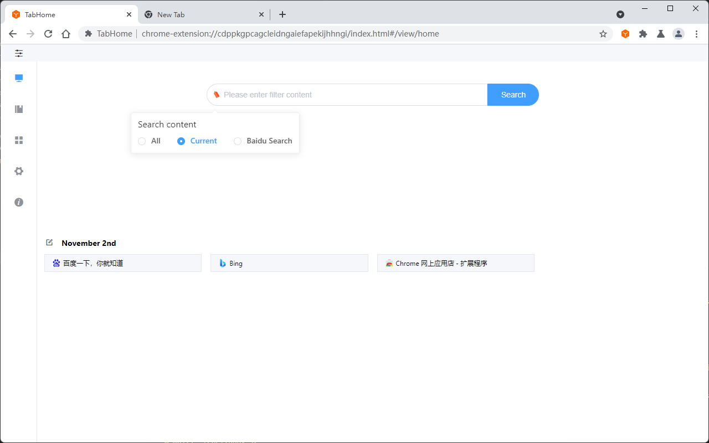
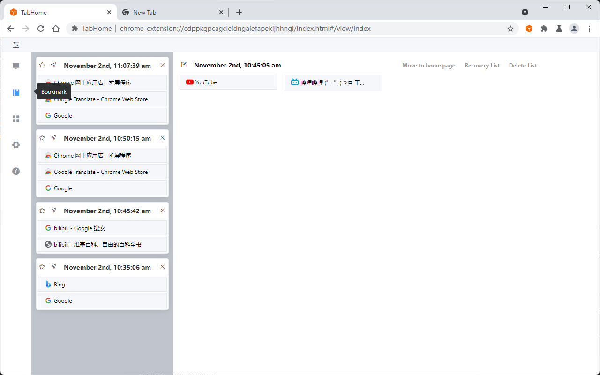
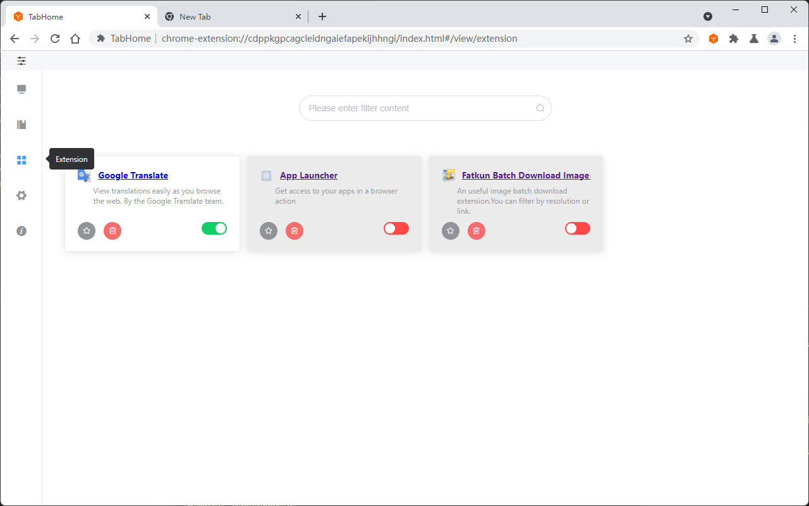
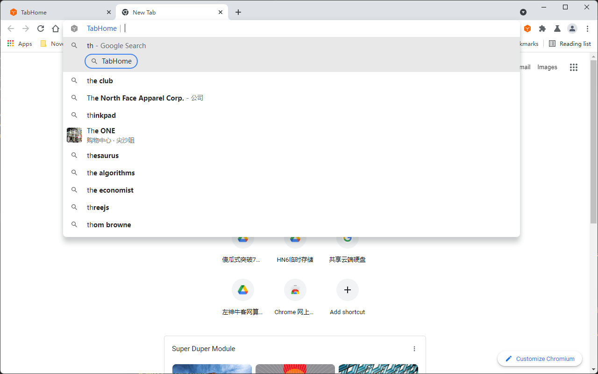
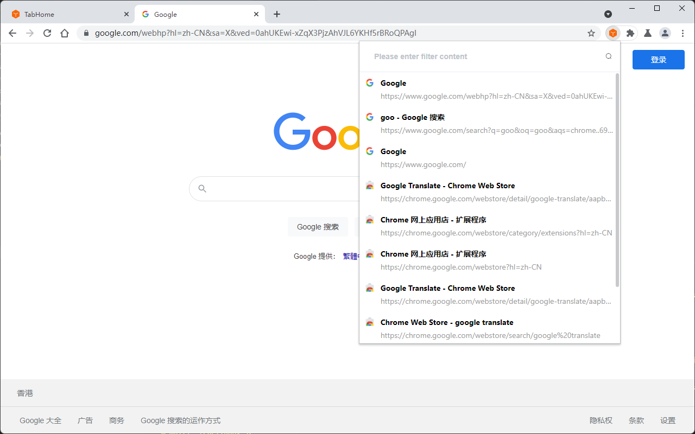
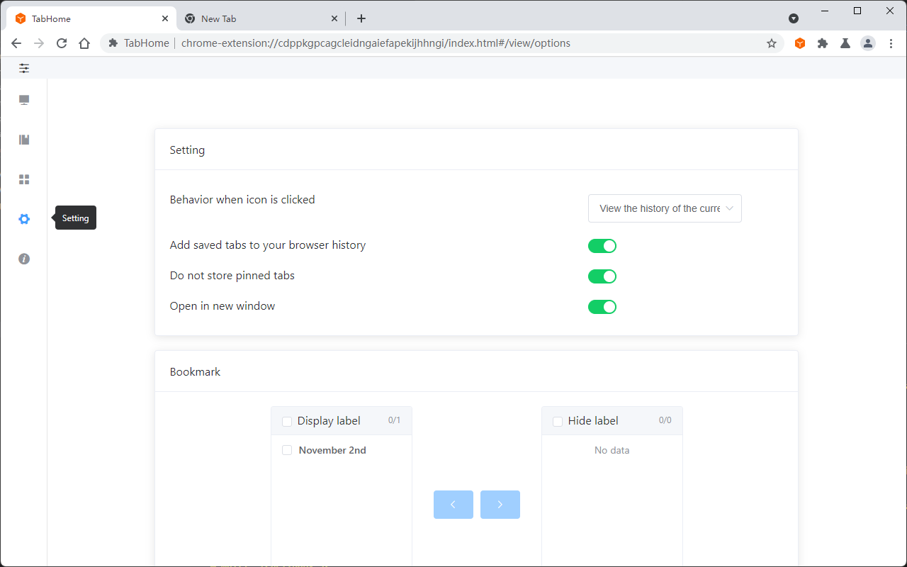

  

<h1 align="center">TabHome</h1>

安装地址：  
[Chrome 网上应用店](https://chrome.google.com/webstore/detail/tabhome/niiapeibeibgagkbjbicpcljemedehcf)   
[Microsoft addons](https://microsoftedge.microsoft.com/addons/detail/tabhome/bdafbnhjbgfpgfheddigmlbabkpdfebm)

---

[ENGLISH README](README.en.md)

类似于OneTab，处理Chrome"其他文件夹"的书签。有存储"临时"书签，分类保存书签，快捷键操作，自定义设置，快捷查看书签，支持搜索栏直接搜索书签，高效管理书签等功能。查看当前网站的浏览历史，管理已安装扩展插件。

### 1 教程

#### 主页导航

#### 书签tab

#### 浏览器扩展管理

#### omnibox 搜索

#### 当前域名网站历史纪录

#### 功能设置

[教程讨论（Tutorial discussion） · Issue #1 · Yinbe/TabHome](https://github.com/Yinbe/TabHome/issues/1)

[我已看过教程讨论；想要更多功能或者提交BUG？在这里告诉我吧](https://github.com/Yinbe/TabHome/issues/new)

#### 功能

- “临时”书签
- 暂存书签
- 支持书签同步
- 主页书签导航
- 拖拽标签
- 搜索框快捷搜索书签
- 显示当前域名网站历史纪录
- 浏览器扩展管理
- 快捷键
- 设置
- 图标右键菜单
- 右键菜单（页面上下文菜单）
- 支持中英文

#### 8种操作

- 显示列表
- 储存左边的标签
- 储存右边的标签
- 储存选中的标签
- 储存未选中的标签
- 储存所有标签
- 储存所有窗口的所有标签
- 显示当前网站历史纪录

### 2 问与答

##### TabHome是什么?

类似onetab处理tab栏溢出保存为书签。并支持对已保存书签做分类处理，形成自定义导航，支持同步！
便捷的书签搜索功能，支持搜索栏快速搜索书签（基于浏览器的"omnibox": { "keyword" : "th" }）,关键词th。
支持浏览器扩展管理，轻松关闭开启搜索扩展。
快捷显示当前域名网站历史时间段内的浏览纪录纪录。

##### 最佳实践 

- “临时”书签：（书签页左部）用来存储临时书签，类比onetab；但不同于onetab，"bookmark"的“临时”书签上的书签是保存到chrome，和其他书签无异。使用完后可以删除或者保存到 “暂存书签”。（来自大佬jerry）
- 暂存书签：（书签页右部）采用流式布局。可修改文件夹内容；拖拽合并书签文件夹。大规模变动推荐在书签管理器进行修改，效率更高。（来自大佬jerry）
- 导航书签：暂存书签可以整理为一个文件夹，移动到首页，成为导航书签。也可通过原保存书签功能，将书签加入导航。
##### 什么是“TabHome”文件夹

“TabHome”文件夹时设定来存放“临时”书签。

如果存在多个，只会显示一个；请保持有且仅有一个“TabHome”的文件夹；推荐放到“其他文件夹“的第一层的下面，并置顶”。

##### 同步

数据同步由浏览器自带同步功能提供，请登录你的账号并开启同步。

##### 兼容

只在chrome和新版Edge开发和测试。但是理论支持其他可以安装chrome插件的浏览器。[兼容讨论（Compatible discussion） · Issue #2 · Yinbe/TabHome](https://github.com/Yinbe/TabHome/issues/2)

### 3 安装

[Chrome 网上应用店](https://chrome.google.com/webstore/detail/tabhome/niiapeibeibgagkbjbicpcljemedehcf)  

[Microsoft addons](https://microsoftedge.microsoft.com/addons/detail/tabhome/bdafbnhjbgfpgfheddigmlbabkpdfebm)

### 4 开发

从源码中编译：

- Clone 这个仓库
- 安装依赖 (使用 `yarn` 命令)
- 自动重新加载 (使用 `yarn dev` 命令)
- 点击 `加载已解压的扩展程序` 按钮并选择 `./dist` 目录
- 编译并打包 (使用 `yarn build` 命令)

### 5 许可

GPL3.0

### 6 感谢

fork自大佬jerry · [rejerry/bookmark](https://github.com/rejerry) 遵循开源协议GPL3.0开发，表示感谢！  
部分参考 [cnwangjie/better-onetab: A better OneTab for Chrome &amp; Firefox](https://github.com/cnwangjie/better-onetab) ，表示感谢！  
部分参考 [fiteprint/fiteprint: 站内足迹 - 当前网站浏览历史](https://github.com/fiteprint/fiteprint) ，表示感谢！

### 7 最后

欢迎安装使用（[TabHome](https://github.com/Yinbe/TabHome)），讨论bug，讨论功能三连。欢迎在插件下面评价，Star项目
