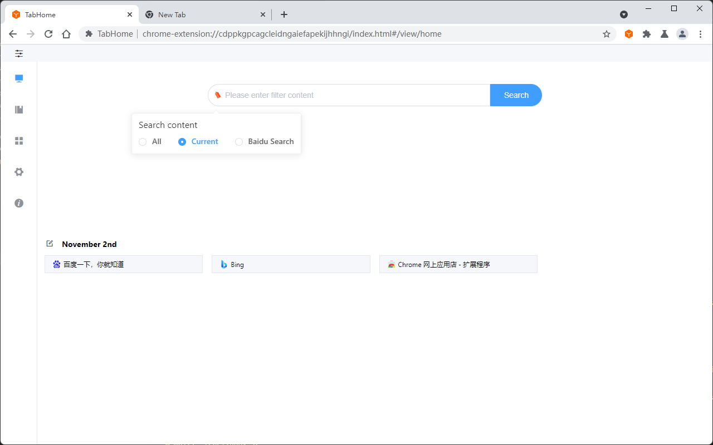
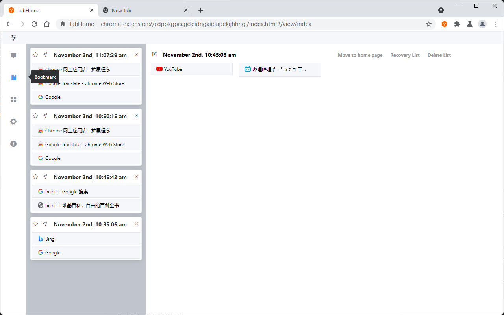
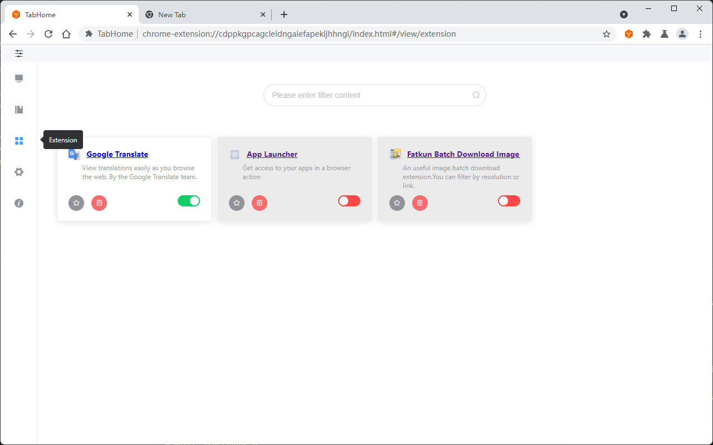
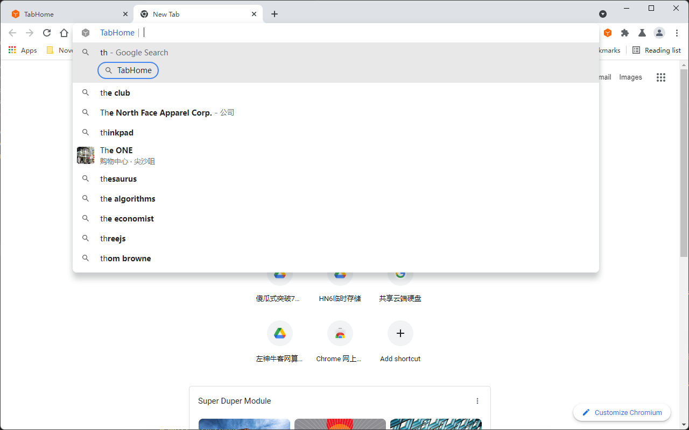
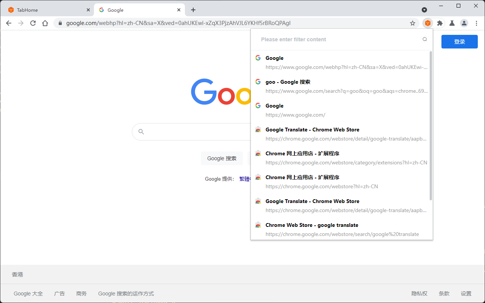
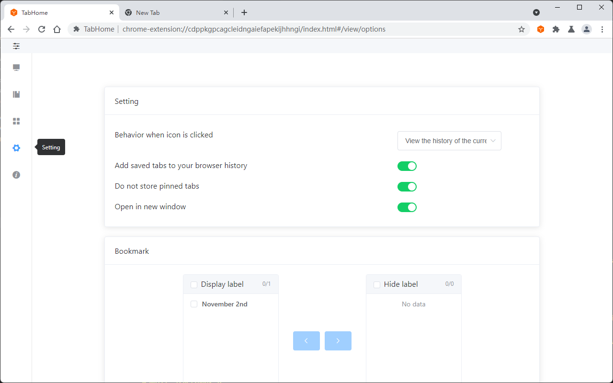

  

<h1 align="center">TabHome</h1>

Installation ：

* [Chrome Web Store](https://chrome.google.com/webstore/detail/tabhome/niiapeibeibgagkbjbicpcljemedehcf)
* [Microsoft addons](https://microsoftedge.microsoft.com/addons/detail/tabhome/bdafbnhjbgfpgfheddigmlbabkpdfebm)

---

[中文README](../README.md)

Similar to OneTab, handles bookmarks for Chrome "other folders". There are functions such as storing "temporary" bookmarks, saving bookmarks in categories, shortcut key operations, custom settings, quick viewing of bookmarks, support for direct search of bookmarks in the search bar, and efficient management of bookmarks. View the browsing history of the current website and manage the installed extensions.

### 1 Tutorials

#### Home navigation

#### Bookmarks tab

#### Browser extension management

#### omnibox search

#### History of the current domain name website

#### Function setting

[教程讨论（Tutorial discussion） · Issue #1 · Yinbe/TabHome](https://github.com/Yinbe/TabHome/issues/1)

[I have watched the tutorial discussion; want more features or submit a bug?](https://github.com/Yinbe/TabHome/issues/new)

#### Function

- "Temporary" bookmarks
- Temporary bookmarks
- Support bookmark synchronization
- Home page bookmark navigation
- Drag and drop tags
- Quickly search bookmarks in the search box
- Display the history of the current domain name website
- Browser extension management
- hot key
- set up
- Icon right-click menu
- Right-click menu (page context menu)
- Support Chinese and English

#### 8 operations

- Display list
- Save the label on the left
- Save the label on the right
- Save the selected label
- Save unselected labels
- Save all tags
- Store all tabs of all windows
- Display the current website history

### 2 Q&A

#### What is TabHome?

Similar to onetab handles tab bar overflow and saves it as a bookmark. It also supports sorting the saved bookmarks, forming a custom navigation, and supporting synchronization!
Convenient bookmark search function, support search bar to quickly search bookmarks (based on browser "omnibox": {"keyword": "th" }), keyword th.
Support browser extension management, easily turn off the search extension.
Quickly display the browsing history of the current domain name website in the historical time period.

#### Best Practices

- "Temporary" bookmarks: (left part of the bookmark page) is used to store temporary bookmarks, analogous to onetab; but different from onetab, the bookmarks on the "temporary" bookmarks of "bookmark" are saved to chrome, just like other bookmarks. It can be deleted or saved to "temporary bookmark" after use. (From the boss jerry)
- Temporary bookmarks: (the right part of the bookmark page) adopts a stream layout. You can modify the contents of the folder; drag and drop to merge the bookmark folders. Large-scale changes are recommended to be modified in the bookmark manager, which is more efficient. (From the boss jerry)
- Navigation bookmarks: Temporary bookmarks can be organized into a folder and moved to the home page to become navigation bookmarks. You can also add bookmarks to the navigation through the original bookmark save function.

#### What is the "TabHome" folder

The "TabHome" folder is set to store "temporary" bookmarks.

If there are more than one, only one will be displayed; please keep one and only one "TabHome" folder; it is recommended to put it under the first layer of "Other Folders" and put it on top.

#### Synchronize

Data synchronization is provided by the browser's built-in synchronization function. Please log in to your account and enable synchronization.

#### compatible

Only developed and tested in chrome and the new version of Edge. But the theory supports other browsers that can install chrome plug-ins.[兼容讨论（Compatible discussion） · Issue #2 · Yinbe/TabHome](https://github.com/Yinbe/TabHome/issues/2)

### 3 Installation

[Chrome Web Store](https://chrome.google.com/webstore/detail/tabhome/niiapeibeibgagkbjbicpcljemedehcf)

[Microsoft addons](https://microsoftedge.microsoft.com/addons/detail/tabhome/bdafbnhjbgfpgfheddigmlbabkpdfebm)

### 4 Development

Compile from source code:

- Clone this warehouse
- Install dependencies (use `yarn` command)
- Automatic reload (using `yarn dev` command)
- Click the `Load unzipped extension` button and select the `./dist` directory
- Compile and package (use `yarn build` command)

### 5 License

GPL3.0

### 6 Grateful

* Fork jerry, [rejerry/bookmark](https://github.com/rejerry) Follow the open source agreement GPL3.0 development, thank you!
* Part of the reference [cnwangjie/better-onetab: A better OneTab for Chrome &amp; Firefox](https://github.com/cnwangjie/better-onetab), thank you!
* Part of the reference [fiteprint/fiteprint: site footprint-current website browsing history](https://github.com/fiteprint/fiteprint), thank you!

### 7 Finally

Welcome to install and use ([TabHome](https://github.com/Yinbe/TabHome)), discuss bugs, and discuss three functions. Welcome to comment below the plug-in, the Star project
